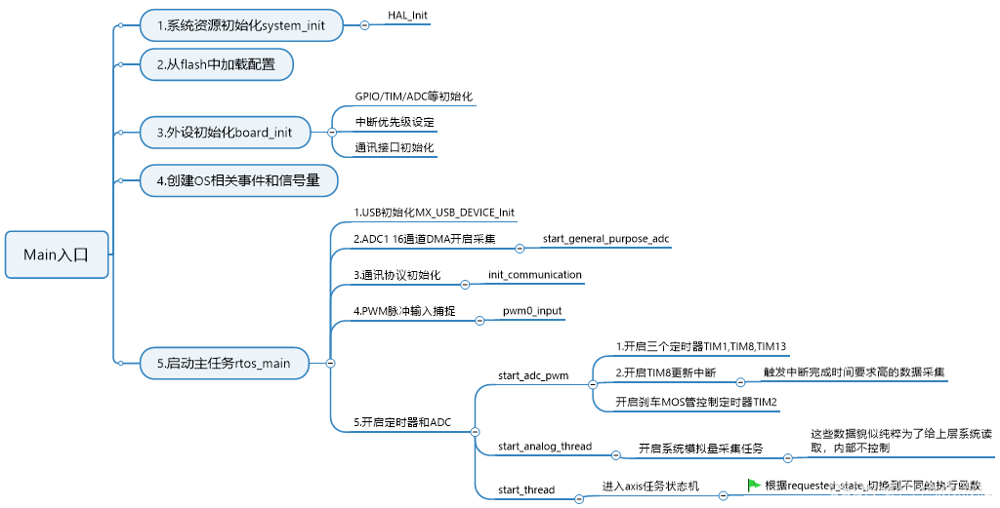
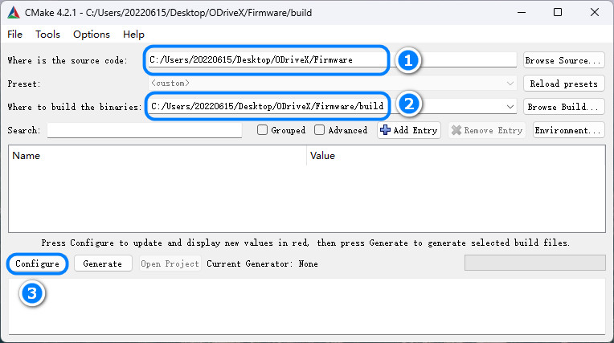
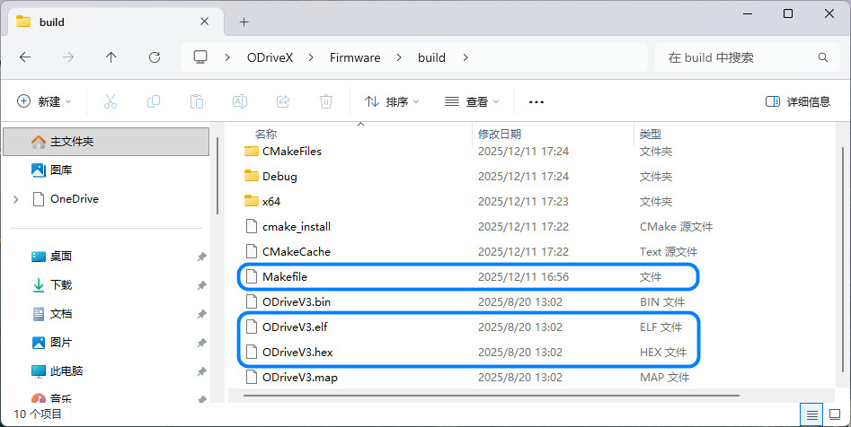
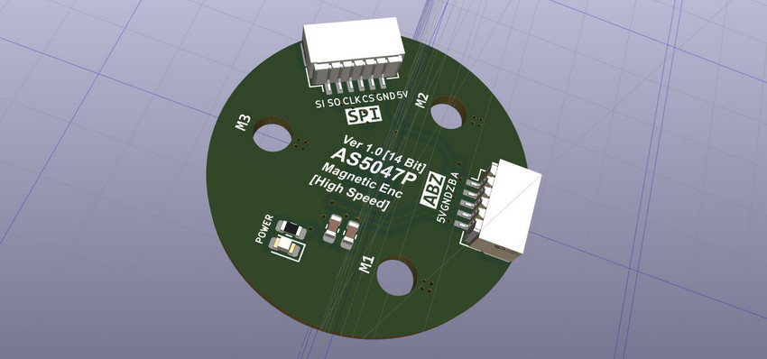
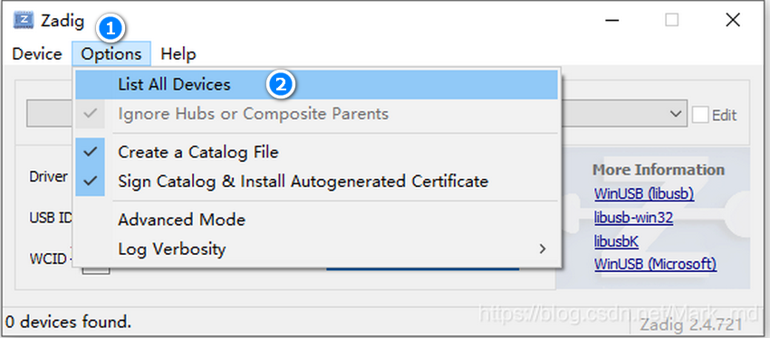
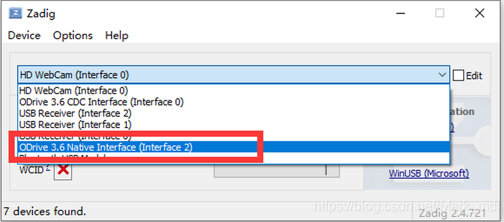
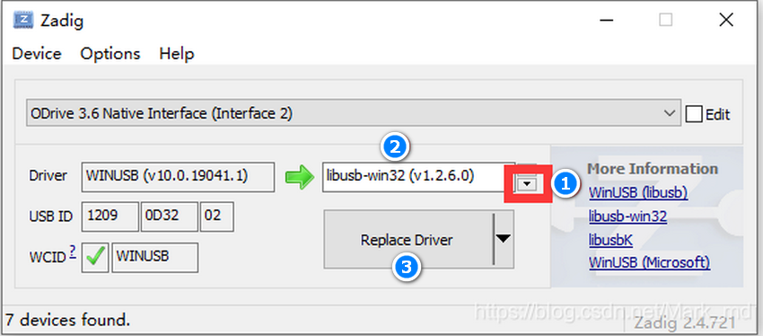
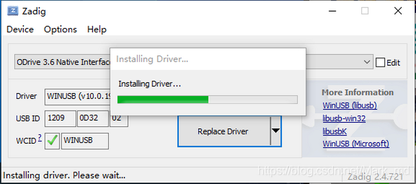
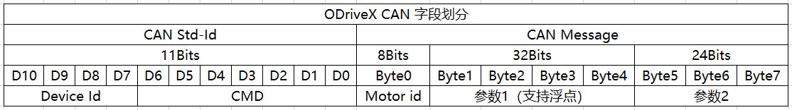

## ODriveX

无刷电机和有刷电机最大的区别就是没有 “有刷电机” 的机械换向（电刷），无刷电机是通过电子换向来驱动转子不断地转动，电机的电压和 KV 值决定了电机转速，而电机的转速就决定了换向的频率。


**而这个换向的操作，就是需要驱动器去完成的**，所以无刷电机需要驱动器。**ODriveX** 除了实现必须的 **换向操作** 还额外实现了：

(1) 位置闭环 (2) 速度闭环 (3) 电流闭环 PID 闭环机制。

## 硬件

(1) 三相逆变功率级：英飞凌耐压 60V，载流100A 的 DirectFET MOSFET 开关管（基于成本考虑可以选择其他的型号）。

(2) MOS 栅极驱动 IC：TI 德州仪器 Drv8301（半桥驱动电路的实现比较复杂，要考虑开关管的开关频率、开启和关断时间不对称、死区问题等等，所以使用集成 MOS 驱动芯片）。

> Drv8301 集成 DCDC 电源，可以输出为 CAN/RS485 提供 +5V 供电。

(3) RS485 收发器：TI 德州仪器 SN75176B（基于成本考虑可以选择其他的型号）。

(4) CAN2.0B 收发器：NXP 恩智浦 High-speed CAN transceiver TJA1051（基于成本考虑可以选择其他的型号）。

(5) 磁编码器：Ams 艾迈斯 AS5047P-ATSM 增量式编码器。

(6) 主控 MUC 芯片：意法半导体 STM32F405。

## 关于打样

ODriveX 硬件 PCB 分为以下两部分（编码器 AS5047P 集成到电机和驱动器分离）：

驱动器板 MotorKit（PCB 采用 **4 层板** 设计）：[HardWare/kiacd_project](./HardWare/kiacd_project) 

编码器板 AS5047P-Driver：[HardWare/AS5047P/HardWare](./HardWare/AS5047P/HardWare)

> 如果想自己修改 PCB 需要安装 KiCad（开源的 EDA 工具，也非常易学），官方下载地址：[https://www.kicad.org/](https://www.kicad.org/)。

打样制作可以直接进入到下面这两个路径下：

把 MotorKit Gerber 文件夹 [HardWare/Gerber](./HardWare/Gerber) 压缩为 MotorKit.zip

把 AS5047P Gerber 文件夹 [HardWare/AS5047P/HardWare/Gerber](./HardWare/AS5047P/HardWare/Gerber) 压缩为 AS5047P.zip

把这两个 `.zip` 给 PCB 制造厂即可（例如 JLC，**PCB 经过打样验证，可以放心使用**）。

**器件 BOM 目录**：[HardWare/ibom.html](./HardWare/ibom.html)（PCB 没器件位号，按网页交互式 BOM 贴片）。

## 核心固件

固件主要包括几大功能模块：

- Board 驱动：板载的各种硬件驱动比如 USB、编码器、CAN
- ThirdParty库：ARM的CMSIS驱动，ST官方的HAL库，包括 FreeRTOS 支持包，LetterShell 嵌入式 Shell 库。
- Drivers：DRV8301 栅极驱动配置，STM32 GPIO，SPI 抽象/对象化，非易失储存等等
- MotorControl：电机控制核心代码，包括 FOC，三环控制器，电流采集，校准等等（想了解 FOC 控制的看这部分代码即可）
- communication：上层 CAN 控制应用协议，可以基于 ODriveX 提供的协议控制同步电机状态/参数。



## 编译下载

固件没有使用 ARM Keil 开发，而是先用 CMake 构建出 Makefile，然后再用 arm-gcc 编译（可以自己创建 F405 的 Keil 工程，把 ODriveX 组织到 Keil 编译）。

ODriveX 用的是 VSCode 搭配 OpenOCD 图形化下载调试，需要下载安装下列工具链：

MiniGW： https://sourceforge.net/projects/mingw-w64/files/

arm-gcc ： [Downloads | GNU Arm Embedded Toolchain Downloads – Arm Developer](https://developer.arm.com/downloads/-/gnu-rm)

openOCD： [Download OpenOCD for Windows](https://gnutoolchains.com/arm-eabi/openocd/)

CMake： [Download CMake](https://cmake.org/download/)

VSCode： [https://code.visualstudio.com/](https://code.visualstudio.com/)

> 安装后具体如何配置使用这些工具，篇幅较长不写在这里，我把具体配置使用方法写在这里： [工具链配置使用方法](https://blog.csdn.net/jf_52001760/article/details/126826393)。

**ODriveX 编译步骤**：



(2) 在 Firmware 目录下创建 build 目录，并指定到 `2` 这里。

(3) 点击 "Configure"，在弹出面板选择目标工程，如下图。


(5) 在 vscode 的命令行 `cd build` 进入 `build/` 目录，然后执行 make -j2 即可开始编译。



(6) 使用 openOCD 把 `.elf` 文件下载到 ODriveX 硬件，下载方法同样参照 [工具链配置使用方法](https://blog.csdn.net/jf_52001760/article/details/126826393)（PCB 上预留了 SWD 调试接口同时支持固件下载）。

## 电机选型

我购买的是大疆 2312S 无刷电机（大疆精灵 3 无人机的拆机电机），可以在淘宝搜索购买。

Rated working voltage of single motor: 14.4 V

Rated working current of single motor: 2.5 A (Maximum current is 10.5 A when there is no payload)

Maximum speed: 8500 rpm

极对数 pole pairs 为 7

> 什么是极对数？
> 
> 极数是指电机转子（即永磁体部分）磁场中磁极的总数量，磁极总数除以 2 就是极对数，极对数用 P 表示，每个极对包含一个北磁极 N 和一个南磁极 S。

## 编码器安装

在电机轴上安装径向磁铁（用于磁编码器检测），磁铁尺寸 $d=6mm$，$h=2mm$，注意径向磁铁和轴同心度不要过度偏移，然后把 AS5047P 编码器模块用 M2.5 螺丝固定到电机尾部，磁铁与编码器的间隙大概为 $1.0mm$。



编码器使用 ABZ 接口（外接的编码器通信线较长，建议使用 ABZ 接口，通信更稳定）。

## 安装 USB 驱动

将 ODrive供电，通过USB线缆连接电脑。

下载并打开 `zadig`，zadig 这里下载 [https://zadig.akeo.ie/](https://zadig.akeo.ie/)。

列表所有设备 `Options` - `List All Devices`。



选择 `ODrive 3.6 Native Interface`（注意不要选择 CDC）。



点击下拉列表，选择 `libusb-win32` 驱动，点击 `Replace Driver` 替换驱动。



等待驱动安装完成。



## Configuration

控制参数（例如 PID，电流，速度，扭矩限制等等）都是包含默认值的，所以不需要逐个配置参数电机也能正常工作起来的。

**必须要注意修改的是**：根据实际编码器配置 cpr（例如 AS5047P 编码器使用 ABZ 接口时 cpr 为 1000x4=4000），index 参数，根据电机配置极对数 pole pairs（例如大疆 2312s 电机的极对数为 7），以及按实际调整电流采样电阻，配置一些必须变更的即可。

**配置方法：**

ODriveX 连接 PC，在 PC 用串口调试助手（建议使用 MobaXterm）下发 Shell 指令修改电机配置，常用的 Shell 命令看 [shell_cmd_list.c](./Firmware/ThirdParty/LetterShell/src/shell_cmd_list.c) 这里。

更深入的配置可以在代码中配置，参数集中在每个对象 class 的 `struct Config_t` 字段，修改它们就会改变配置，例如 Motor 对象：

```cpp
class Motor : public ODriveIntf::MotorIntf {
public:
    struct Config_t {
        bool pre_calibrated = false; // can be set to true to indicate that all values here are valid
        int32_t pole_pairs = 7;
        float calibration_current = 10.0f;    // [A]
        float resistance_calib_max_voltage = 2.0f; // [V] - You may need to increase this if this voltage isn't sufficient to drive calibration_current through the motor.
        float phase_inductance = 0.0f;        // to be set by measure_phase_inductance
        float phase_resistance = 0.0f;        // to be set by measure_phase_resistance
        ...
        ...
    }
}
```

## 关于校准

初次启动要校准电机和编码器，校准时电机最好不要携带负载，保证能自由转动。

> ODriveX 连接 PC，在 PC 用串口终端（例如 MobaXterm）或串口调试助手（例如 sscom）向驱动器发送下面的 Shell 指令。

**校准电机**：

```cpp
odrive:/$ axis_requested_state 0 4 /**< 0 指电机id号*/
```

校准过程会测量电机相电阻、电机相电感，并根据相电阻相电感自动生成电流环 PI 增益，当听到电机发出 “哔” 声后表示测量完成。

**校准编码器**：

定位编码器索引信号，启动后将开环控制电机朝着一个方向旋转直到检测到索引脉冲信号时停止（找编码器器零点：驱动电机和编码器参考零点位置对齐）。

```cpp
odrive:/$ axis_requested_state 0 6 /**< 0 指电机id号*/
```

编码器偏移校准，启动后将开环控制电机朝着一个方向正转一圈然后反方向反转一圈后停止，开环旋转时的电流（扭矩）大小由 motor.config.calibration_current 参数决定。

```cpp
odrive:/$ axis_requested_state 0 7 /**< 0 指电机id号*/
```

> 其实这上面这 3 个步骤可以用下面这条指令一步完成
> 
> ```cpp
> odrive:/$ axis_requested_state 0 3 /**< 0 指电机id号*/
> ```

**设置预校准**：

将电机和编码器的 pre_calibrated 设置为 True，表示电机和编码器已校准，下次重新启动可以不用再次校准。

```cpp
pre_calibrated 0 1 /**< 0 指电机id号*/
```

> 注意：即使设置了 **预校准**，对于增量编码器（非绝对值编码器）每次重新启动后都需要编码器索引校准（即：找编码器器零点 INDEX_SEARCH），但不用偏移校准。如果编码器没有索引信号 Z (只有 AB) 则每次重新启动都要编码器偏移校准。

**保存校准结果**：

如果不保存下次启动要再次校准，执行后驱动器将自动检查电机的参数保存并重启。

```cpp
dev_config "save"
```

**提示**：

> 每个步骤执行完后用这条指令列出错误信息
> 
> odrive:/$ dump_errors 1
> 
> 参数 1 指的是列出错误的同时清除错误状态

如果没有错误则电机状态 OK，可以进行后续步骤，出现错误则要根据错误信息分析原因，然后清除错误后重试。

## Start-up

ODriveX 使用时基本的启动流程：

(1) 设置电流，速度限制参数（防止限值太小出现超限错误）。

(2) 电机校准（实际就是测量电机的相电阻和相电感）。

(3) 搜索定位编码器 index 信号（在编码器偏移校准之前必须先搜索 index）。

(4) 编码器偏移校准（Offset 校准）。

(5) 使能闭环状态/开环状态。

(6) 设置控制模式（控制模式包含：位置模式，速度模式，电流模式）。和 (4) 结合起来就得到，位置闭环控制模式，速度闭环控制模式，电流闭环控制模式。

(7) 设置控制模式目标值（位置值，速度值，电流值）来调节电机运行状态。

(8) 电机因异常停止后清除错误重新使能进入闭环状态即可。

**对应操作命令：（注意浮点参数需要包含双引号）**

```cpp
(1) 设置最大负电流
odrive:/$ dc_max_negative_current "-2.0"

(2) 设置速度限制 50 turn/s
odrive:/$ controller_config_vel_limit 0 "50.0" /**< 0 指电机id号*/

(3) 设置电机 0 进入校准状态
odrive:/$ axis_requested_state 0 3 /**< 0 指电机id号*/

(4) 设置电机 0 进入力矩控制模式
odrive:/$ controller_config_control_mode 0 1 /**< 0 指电机id号*/

(5) 设置电机 0 控制力矩
odrive:/$ controller_input_torque 0 "0.02" /**< 0 指电机id号*/

(6) 进入闭环
odrive:/$ axis_requested_state 0 8 /**< 0 指电机id号*/

(7) 如果发生错误，可以打印当前错误并清除错误状态
odrive:/$ dump_errors 1
```

以上也是电机运行起来必要的 Shell 指令，保存过校准参数的电机可以跳过 `(3)` 这一步。

## Shell Command

我移植了 Letter shell，让 ODriveX 可以像 Linux 一样使用 Shell 命令操作，Shell 支持配置电机参数，读写参数变量，或实时 PID 调参。

> Letter shell 是一个可以嵌入在程序中的嵌入式 Shell，面向嵌入式设备，以 C 语言函数为运行单位，可以通过命令行调用，运行程序中的函数。

具体命令在 [ThirdParty/LetterShell/src/shell_cmd_list.c](./Firmware/ThirdParty/LetterShell/src/shell_cmd_list.c) 这里定义，具体可以看这个文件。

## CAN Protocols

一帧 CAN 报文只能传 8 个字节数据，和 11 位的标准 Std-Id，这里把 Std-Id 的低 7 位也用作数据，用来传控制指令字 CMD，控制协议定义如下：



Device Id 占用 4 位，CMD 占用 7 位，Motor id 占用 1 个字节，协议最多两个参数：参数 1 占用 4 个字节，参数 2 占用 3 个字节。

> Device Id：驱动器 ID，CMD 控制指令字，Motor id 被控电机编号。
> 
> 个别协议要两个参数，例如位置控制：设置目标位置和速度限制。

由于参数 2 只有 3 个字节所以无法直接传递浮点数，要用整数量化浮点数。在下发控制报文时，把浮点目标值量化为整形填入报文，参考转换方法如下。

```cpp
uint32_t ODriveCAN::fto_i(float x, float x_min, float x_max, uint8_t bits)
{
    float span = x_max - x_min; /*浮点范围*/
    float ref = x_min; /*输入范围起点*/

    if (x < x_min) x = x_min;
    else if (x > x_max) x = x_max;

    return (uint32_t)((x - ref) * ((float)((1 << bits) - 1)) / span);
}
```

> 其实 Motor id 不必占用 1 个字节，占用 3 位即可，虽然节约位数，但这样一来协议参数的表示位数会变得非常割裂，取值要位操作（可读性差）。

具体指令在 [communication/can/odrive_can.cpp](./Firmware/communication/can/odrive_can.cpp) 这里定义，具体可以看这个文件。

## 其他

**Step/Dir：**

Choose any two of the unused GPIOs for step/dir input. Let’s say you chose GPIO7 for the step signal and GPIO8 for the dir signal.

选择任意两个未使用的 GPIO 即可用于 step 和 dir 信号步骤/输入，假设您选择 GPIO7 作为步长信号，GPIO8 选择用于 dir 信号。

这种是基于 step 对应 GPIO 中断对外部电平输入步数累计（中断次数累计），达到位置控制信号可以通过普通 GPIO 输入的目的，

注意这不是 PWM 输入控制模式，两者是有区别的。

This is the simplest possible way of controlling the ODrive. It is also the most primitive and fragile one. So don’t use it unless you must interoperate with other hardware that you don’t control.

这是给驱动器提供控制指令信号最简单的方法。 它也是最原始且最脆弱的一个。因此,除非必须与其他无法控制的硬件进行互操作,否则请勿使用。
